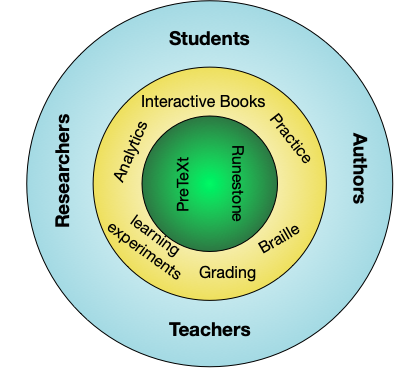

PROSE is a project scoping the development of an Open-Source Ecosystem (OSE) surrounding PreTeXt
and Runestone software products that enable the authoring and publishing of [accessible](https://en.wikipedia.org/wiki/Accessibility)
[Open Educational Resources](https://en.wikipedia.org/wiki/Open_educational_resources) in STEM. Through a series of
virtual and in-person roundtable discussions, office hours, and [workshops](./workshop.html), we will engage instructors, authors,
publishers, and researchers using these products to develop a vision and strategic plan for our OSE.

## 2023 PROSE Summer Programs

Learn how to get involved in one of our [2023 Summer Programs](./summer/).

## What are PreTeXt and Runestone?

[PreTeXt](https://pretextbook.org) is an open-source language that allows STEM textbook authors to describe their content
in a single source. This content can include words, images, embeddable videos, applets,
and much more. Our open-source software is able to convert this single source into a printable PDF,
accessible and interactive HTML, tactile braille code, and more formats. These documents can then
be deployed to freely-available static web hosts, with [GitHub Pages](https://pages.github.com) support built-in.

[Runestone](https://runestone.academy) is a Learning Engineering Analytics Portal (LEAP) built with open-source software
that enhances PreTeXt-authored HTML, providing an all-inclusive solution for managing a course.
Students and instructors are able to log into Runestone-hosted textbooks, allowing instructors to
assign content from the book for students to complete online. Going beyond a traditional learning management system, Runestone 
applies evidence-based principles and methods from educational technology and the learning sciences to create engaging and 
effective learning experiences, supporting the difficulties and challenges of learners as they learn.
Runestone's deep analytics not only help students and instructors optimize learning, but also support
authors and researchers that want to study how books are being used, and evaluate interactive pedagogical features
of online books that improve student learning.

## Connect via Social

Our community members are active on these corners of the internet:

- GitHub: [PreTeXtBook](https://github.com/PreTeXtBook) and [RunestoneInteractive](https://github.com/RunestoneInteractive)
- Google Groups: [pretext-announce](https://groups.google.com/g/pretext-announce)
- Twitter: [@PreTeXtBook](https://twitter.com/pretextbook), [@iRunestone](https://twitter.com/irunestone)
- Mastodon: <a href="https://fosstodon.org/@PreTeXt" rel="me">@PreTeXt@fosstodon.org</a>
- Discord: [Runestone Academy](https://discord.gg/f3Qmbk9P3U)

## Project Team

- [Steven Clontz](https://clontz.org) (<sclontz@southalabama.edu>), PreTeXt-Runestone core contributor and PROSE Phase I coordinator
- [Rob Beezer](https://pretextbook.org), PreTeXt founder and maintainer
- [Brad Miller](https://runestone.academy), Runestone founder and maintainer

## Upcoming Events

Check the bottom of the calendar to confirm the timezone - no displayed timezone indicates the calendar is using your computer's local time.

<iframe src="https://calendar.google.com/calendar/embed?height=600&wkst=1&bgcolor=%23ffffff&mode=AGENDA&showNav=1&showCalendars=0&showTitle=0&src=ODhjYmI0NWJhNDdjMDk0Yjk0ZjFkNjg1MjJhMTQxZjQ5NTllZWRlMDFiMDNjYzQ1MzAyNzg0YTE0ODJlY2Y3ZkBncm91cC5jYWxlbmRhci5nb29nbGUuY29t&color=%23F09300" width="100%" height="600" frameborder="0" scrolling="no"></iframe>

---

 PROSE is supported by <a href="https://www.nsf.gov/awardsearch/showAward?AWD_ID=2230153">NSF Award #2230153</a>.

<blockquote style="font-size:0.8em;text-align:justify">Science, Technology, Engineering and Mathematics (STEM) educational materials that are open-sourced and made freely available to learners and educators, known as Open Educational Resources (OER), require an infrastructure that exceeds the quality of commercial alternatives. This project scopes the creation of an Open-Source Ecosystem (OSE) consisting of two existing open-source products: PreTeXt for authoring scholarly documents and textbooks suitable for all areas of STEM, and the Runestone learning engineering and analytics portal for publishing OER textbooks that support both instruction and education research in K-12 and higher education. The long-term societal impacts of this OSE are open-source textbooks that are made freely available to the nation’s STEM classrooms and students through the Open-Source Ecosystem’s support of instructors, authors, and researchers. Furthermore, the OER has the potential to reflect cutting-edge advancements in STEM education research by removing the barriers between researchers, authors, instructors, and students. PreTeXt-authored works can be converted into HTML, print, and braille formats, enabling the resulting Open Educational Resources to be accessible to a wide range of learners at no cost, an equitable approach to ensuring that all students have the same access to education.</blockquote>
