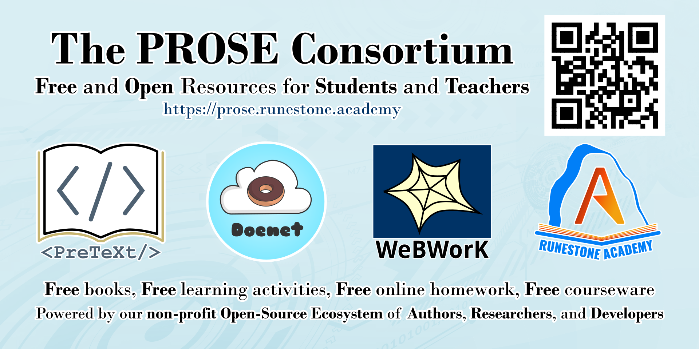

**The PROSE Consortium** brings together the ecosystem of various open source products and communities serving STEM education research and practice in North America, joined by their **common mission: to equip STEM teachers with open-source content, tools and strategies that provide engaging, accessible, and effective learning experiences for their students**.

This Consortium is guided by an Advisory Council of eight leaders from this ecosystem. The Consortium is further served by leaders known as PROSE Fellows, selected by the Council to recognize their contributions to open source STEM education, and to represent the Consortium more broadly. Finally, the Council also recognizes PROSE Ecosystem Products, open source software that advances its mission.

The PROSE Consortium is an initiative of
[Runestone Academy, Ltd](https://landing.runestone.academy/about-us.html), a 501(c)(3) non-profit organization.

## NSF Pathways to Enable Open Source Ecosystems

We are grateful for the [support](https://www.nsf.gov/awardsearch/showAward?AWD_ID=2230153) of the [National
Science Foundation](https://nsf.gov), through its
[Pathways to Enable Open Source Ecosystems](https://new.nsf.gov/funding/opportunities/pathways-enable-open-source-ecosystems-pose) program.

Our Phase I activities are currently scoping the development of our Open-Source Ecosystem (OSE) to maximize our impact supporting the authoring and publishing of [accessible](https://en.wikipedia.org/wiki/Accessibility)
[Open Educational Resources](https://en.wikipedia.org/wiki/Open_educational_resources) in STEM. Through a series of
virtual and in-person roundtable discussions, office hours, and [workshops](./workshop.html), we are engaging studnets, instructors, authors, researchers, and developers using these products as we develop a vision and strategic plan for our OSE.

## What are PROSE Ecosystem Products?

### PreTeXt

[PreTeXt](https://pretextbook.org) is an open-source language that allows STEM textbook authors to describe their content
in a single source. This content can include words, images, embeddable videos, applets,
and much more. Its open-source software is able to convert this single source into a printable PDF,
accessible and interactive HTML, tactile braille code, and more formats. These documents can then
be deployed to freely-available static web hosts, with [GitHub Pages](https://pages.github.com) support built-in.

### Runestone

[Runestone](https://runestone.academy) is a Learning Engineering Analytics Portal (LEAP) built with open-source software
that enhances PreTeXt-authored HTML, providing an all-inclusive solution for managing a course.
Students and instructors are able to log into Runestone-hosted textbooks, allowing instructors to
assign content from the book for students to complete online. Going beyond a traditional learning management system, Runestone 
applies evidence-based principles and methods from educational technology and the learning sciences to create engaging and 
effective learning experiences, supporting the difficulties and challenges of learners as they learn.
Runestone's deep analytics not only help students and instructors optimize learning, but also support
authors and researchers that want to study how books are being used, and evaluate interactive pedagogical features
of online books that improve student learning.

### WeBWorK

[WeBWorK](https://openwebwork.org/) is an open-source online homework system for STEM courses. WeBWorK has been supported by the MAA and the NSF and comes with a Open Problem Library (OPL) of over 35,000 homework problems. Formed in 2018, The WeBWorK Project (TWP) is a non-profit organization that coordinates a large volunteer community that supports the WeBWorK open source software. Members of TWP contribute new questions and features to WeBWorK, curate the open problem library, respond to help requests on the forum, and communicate WeBWorK advancements and research at conferences and in university settings.

### Doenet

[Doenet](https://www.doenet.org/) is an open data-driven educational technology platform designed to measure and share student interactions with web pages. It includes tools for authoring interactive educational content, including its custom DoenetML markup language, and conducting educational research using the content. Its ultimate goal is to provide research-based tools to help instructors and learners discover the most effective content. Simply put, Doenet gives teachers complete flexibility over their educational content and gives them power of anonymized student data to track learning outcomes.

### And yours?

If you are a project leader working on an open-source product
dedicated to empowering STEM teachers with the technology they
need to educate students for success in the 21st century,
reach out to any of our PROSE Advisory Council Members for
more information!

## Connect with us

Our community members are active on these corners of the internet:

- GitHub: [PreTeXtBook](https://github.com/PreTeXtBook), [RunestoneInteractive](https://github.com/RunestoneInteractive), [WeBWorK](https://github.com/openwebwork), [Doenet](https://github.com/Doenet)
- Google Groups: [pretext-announce](https://groups.google.com/g/pretext-announce)
- Twitter: [@PreTeXtBook](https://twitter.com/pretextbook), [@iRunestone](https://twitter.com/irunestone)
- Mastodon: <a href="https://fosstodon.org/@PreTeXt" rel="me">@PreTeXt@fosstodon.org</a>
- Discord: [Runestone Academy](https://discord.gg/f3Qmbk9P3U) and [Doenet](https://discord.gg/PUduwtKJ5h)

## PROSE Advisory Council Members

- [Rob Beezer](https://pretextbook.org), PreTeXt founder and maintainer, and PROSE Phase I co-PI
- [Steven Clontz](https://clontz.org) <<sclontz@southalabama.edu>>, PreTeXt authoring toolchain contributor, [TBIL Resource Library](http://library.tbil.org) maintainer, and PROSE Phase I PI
- [Barbara Ericson](https://www.si.umich.edu/people/barbara-ericson), researcher in Educational Technology, Learning Analytics, and Human Computer Interaction
- [Danny Glin](https://github.com/dlglin), WeBWorK senior contributor
- [Brad Miller](https://runestone.academy), Runestone founder and maintainer, and PROSE Phase I co-PI
- [Jennifer Nordstrom](https://www.linfield.edu/faculty/jfirkins.html), author of [Introduction to Game Theory: A Discovery Approach](https://nordstrommath.com/IntroGameTheory/frontmatter-1.html)
- [Duane Nykamp](https://www-users.cse.umn.edu/~nykamp/), Doenet project lead 

## Upcoming Events

Times displayed are in Eastern Time - New York.

<iframe src="https://calendar.google.com/calendar/embed?height=600&wkst=1&bgcolor=%23ffffff&mode=AGENDA&showNav=1&showCalendars=0&showTitle=0&src=ODhjYmI0NWJhNDdjMDk0Yjk0ZjFkNjg1MjJhMTQxZjQ5NTllZWRlMDFiMDNjYzQ1MzAyNzg0YTE0ODJlY2Y3ZkBncm91cC5jYWxlbmRhci5nb29nbGUuY29t&color=%23F09300&ctz=America%2FNew_York" width="100%" height="600" frameborder="0" scrolling="no"></iframe>

More information on our [2023 Summer Programs is available here](./summer/)

---

 The PROSE Consortium is supported by <a href="https://www.nsf.gov/awardsearch/showAward?AWD_ID=2230153">NSF Award #2230153</a>.

<blockquote style="font-size:0.8em;text-align:justify">Science, Technology, Engineering and Mathematics (STEM) educational materials that are open-sourced and made freely available to learners and educators, known as Open Educational Resources (OER), require an infrastructure that exceeds the quality of commercial alternatives. This project scopes the creation of an Open-Source Ecosystem (OSE) consisting of two existing open-source products: PreTeXt for authoring scholarly documents and textbooks suitable for all areas of STEM, and the Runestone learning engineering and analytics portal for publishing OER textbooks that support both instruction and education research in K-12 and higher education. The long-term societal impacts of this OSE are open-source textbooks that are made freely available to the nation’s STEM classrooms and students through the Open-Source Ecosystem’s support of instructors, authors, and researchers. Furthermore, the OER has the potential to reflect cutting-edge advancements in STEM education research by removing the barriers between researchers, authors, instructors, and students. PreTeXt-authored works can be converted into HTML, print, and braille formats, enabling the resulting Open Educational Resources to be accessible to a wide range of learners at no cost, an equitable approach to ensuring that all students have the same access to education.</blockquote>
